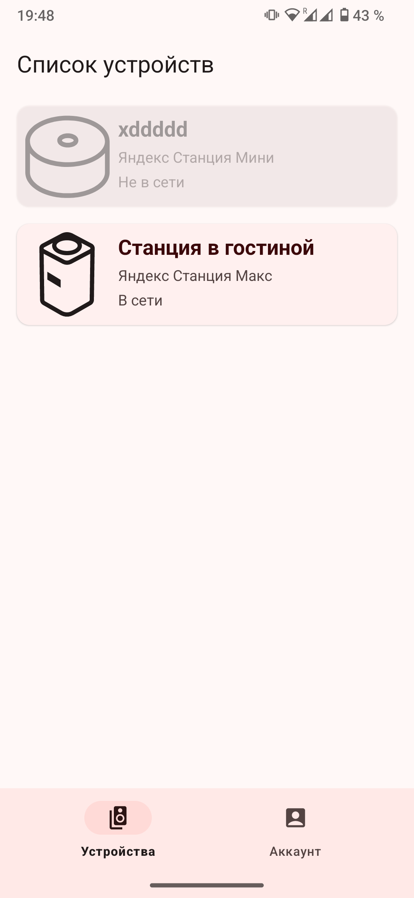
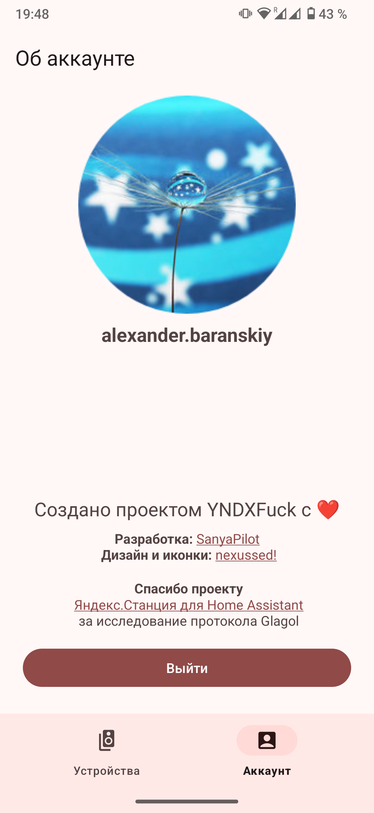
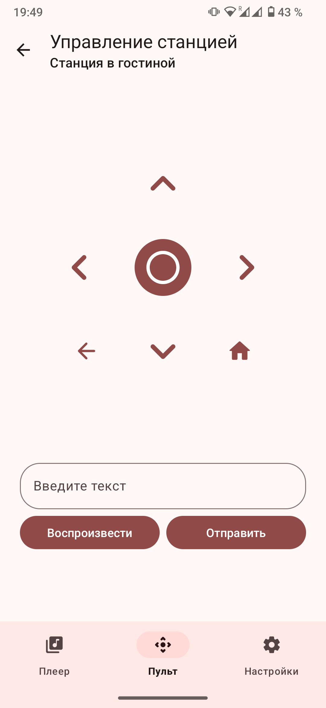
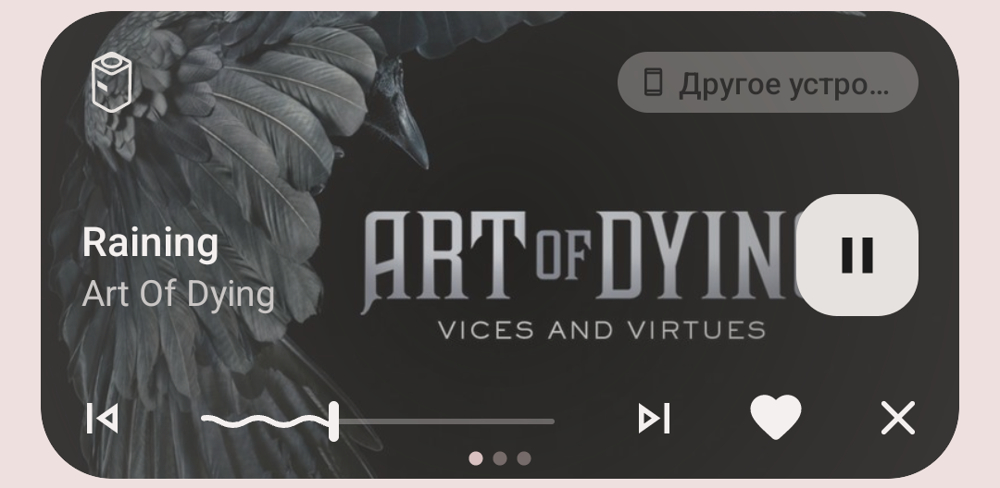

# YNDXRemote

Android приложение, позволяющее управлять вашей Яндекс.Станцией по локальной сети при помощи протокола Glagol.

## Возможности

- Просмотр информации о текущем треке
- Управление воспроизведением (перемотка, переключение треков, включение перемешивания)
- Включение музыки без голосовой команды (Моя волна или избранное)
- TTS (текст в речь, Станция произнесет написанный вами текст)
- Выполнение текстовых команд
- Пульт для навигации по интерфейсу Станции (только на Станциях 1-го поколения и на Станции.Макс)
- Управление настройками станции (в полном объеме только для нескольких устройств)

## Поддерживаемые устройства

Управление воспроизведением и команды должны работать **на всех колонках с локальным управлением**, НО

#### Только эти устройства имеют полную поддержку:

- Яндекс Станция (1-е поколение) - YNDX-0001

- Яндекс Станция Макс - YNDX-0008 (нет настроек ZigBee для 00052/00053)

- Яндекс Станция Мини (1-е поколение) - YNDX-0004

**Остальные устройства не были протестированы** и имеют только базовый набор настроек.

#### Настройки, доступные всем устройствам:

- Управление режимом "Не беспокоить"

- Эквалайзер

- Переименование

- Отвязка от аккаунта

#### Таблица поддержки устройств:

| Устройство                                     | Опции                                                                                                  |
| ---------------------------------------------- | ------------------------------------------------------------------------------------------------------ |
| Яндекс Станция (1-е поколение, YNDX-0001)      | Вид заставки Навигация по интерфейсу                                                               |
| Яндекс Станция Макс (YNDX-0008)                | Вид заставки Навигация по интерфейсу Настройки LED экрана (яркость, часы, визуализация музыки) |
| Яндекс Станция Макс (YNDX-00052/00053)         | Идентично YNDX-0008, настроек ZigBee нет                                                               |
| Яндекс Станция Мини (1-е поколение, YNDX-0004) | Жесты ладонью                                                                                          |
| Яндекс Станция Мини 2 (YNDX-00020)             | Экспериментально включено управление экраном от YNDX-0008, необходимо тестирование                     |

## Скриншоты

## Авторы

- [**SanyaPilot**](https://github.com/SanyaPilot) - почти вся разработка)
- [**nexussed**](https://github.com/nexussed) - иконка, тестирование
- [**rtx4d**](https://github.com/rtx4d) - тестирование

## Контакты

- [Telegram канал проекта](https://t.me/yndxremote_updates)

- Мой Telegram - [@sanyapilot](https://t.me/sanyapilot)

- [Ветка на 4PDA](https://4pda.to/forum/index.php?showtopic=1083965)

## Поддержать проект

Необходимо добавление новых настроек и тестирование приложения на других станциях. Если есть желание помочь с добавлением настроек, напишите мне в Telegram.

Нашли баг? [Создайте issue!](https://github.com/SanyaPilot/YNDXRemote/issues/new)

Также с радостью рассмотрю ваши пул реквесты (если они конечно будут :) )
